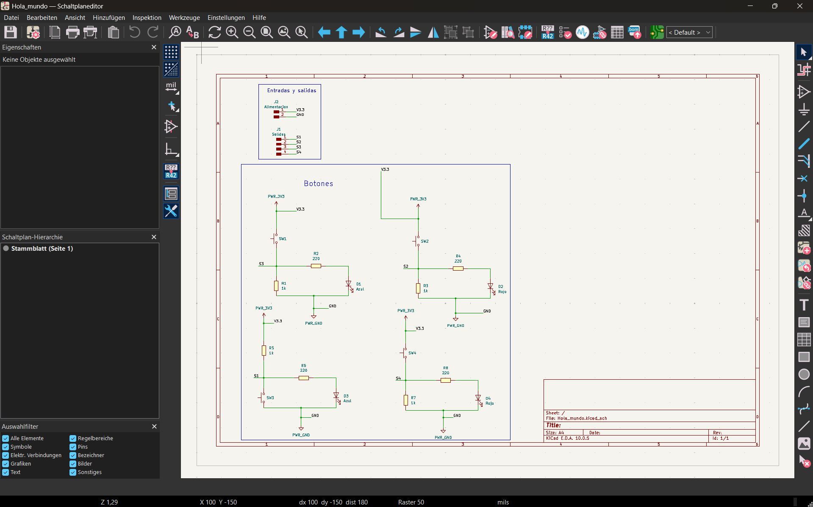

# 🛠️ Reporte de Proyecto: Diseño y Ruteo de PCB en KiCad

**Universidad:** Universidad Iberoamericana Puebla  
**Carrera:** Ingeniería mecatrónica  
**Asignatura:** Producción electrónica  
**Periodo:** 3er semestre  

---

## 👥 Participantes del Equipo

| Nombre Completo | Matrícula / Código |
| :--- | :---: |
| **Aldo Ibrahim Alvarez Fernández** | 204916 |
| **[Nombre del Estudiante 2]** | [234567] |

---

## 📋 Tabla de Contenidos
1. [Introducción y Objetivos](#1-introducción-y-objetivos)
2. [Instalación de Plugins (KiCad FabLib)](#2-instalación-de-plugins-kicad-fablib)
3. [Diseño del Esquema Eléctrico (Schematic Editor)](#3-diseño-del-esquema-eléctrico-schematic-editor)
   - [Selección de Componentes](#31-selección-de-componentes)
   - [Organización y Conexiones](#32-organización-y-conexiones)
4. [Diseño de la Placa de Circuito Impreso (PCB Layout)](#4-diseño-de-la-placa-de-circuito-impreso-pcb-layout)
   - [Definición del Contorno (Edge.Cuts a 2.0 mm)](#41-definición-del-contorno-edgecuts-a-20-mm)
   - [Enrutado y Ancho de Pistas (0.4 mm)](#42-enrutado-y-ancho-de-pistas-04-mm)
   - [Explicación de las Capas del Proyecto](#43-explicación-de-las-capas-del-proyecto)
5. [Exportación de Datos para Fabricación](#5-exportación-de-datos-para-fabricación)
6. [Conclusiones](#6-conclusiones)

---

## 1. Introducción y Objetivos

Este proyecto describe el proceso completo de diseño y desarrollo de una placa de circuito impreso (PCB)  utilizando la herramienta de software libre **KiCad 10**. 

### Objetivos:
* Diseñar un circuito funcional con 4 pulsadores táctiles (`Switch_Tactile_Omron`), 4 LEDs indicadores (Azul y Rojo) con sus respectivas resistencias de limitación y pull-down, y conectores de alimentación/salida.
* Definir una geometría de borde personalizada no rectangular (forma simétrica en "X" / trébol) utilizando la capa de corte.
* Aplicar normas de diseño Gerber y criterios de enrutado (ancho de pistas de 0.4 mm y ancho de línea de borde de 2.0 mm).
* Exportar la documentación de fabricación mediante el plugin **KiCad FabLib**.

---

## 2. Instalación de Plugins (KiCad FabLib)

Para automatizar la generación de archivos Gerber, planos de ensamble y listas de materiales (BOM) estandarizadas, se instaló el complemento **KiCad FabLib** (o gestor de fabricación).

### Pasos de Instalación:
1. Abrir la ventana principal de KiCad.
2. Ingresar al **Gestor de Complementos, Plataformas y Bibliotecas** (*Plugin and Content Manager / PCM*).
3. Buscar `KiCad FabLib` o agregar el repositorio correspondiente.
4. Hacer clic en **Instalar** y presionar **Aplicar Cambios**.
5. Reiniciar el editor de PCB para verificar que el botón o menú del plugin aparezca en la barra de herramientas principal.

---

## 3. Diseño del Esquema Eléctrico (Schematic Editor)

En el módulo `Schaltplaneditor` (Editor de Esquemas), se construyó la lógica eléctrica del proyecto `Hola_mundo.kicad_sch`.

### 3.1 Selección de Componentes
Se seleccionaron e incorporaron los siguientes símbolos y footprints:
* **Pulsadores (4 unidades):** `SW1`, `SW2`, `SW3`, `SW4` (`Switch_Tactile_Omron`).
* **Diodos LED (4 unidades):** 
  * `D1`, `D3`: LEDs Azules (`Azul`).
  * `D2`, `D4`: LEDs Rojos (`Rojo`).
* **Resistencias:**
  * Resistencias de paso/limitación de $220\,\Omega$: `R2`, `R4`, `R6`, `R8`.
  * Resistencias de *pull-down* de $1\,\text{k}\Omega$: `R1`, `R3`, `R5`, `R7`.
* **Conectores de Interfaz:**
  * `J1`: Conector de Salidas de 4 pines (`Salidas`: `S1`, `S2`, `S3`, `S4`).
  * `J2`: Conector de Alimentación de 2 pines (`Alimentación`: `V3.3 / V+` y `GND`).

### 3.2 Organización y Conexiones
El diseño se estructuró mediante bloques funcionales:
1. **Bloque Entradas y Salidas:** Agrupa las clemas/cabezales `J1` y `J2`.
2. **Bloque Botones:** Agrupa las cuatro etapas de conmutación. Cada botón envía su señal de salida (`S1`–`S4`) al conector `J1` al presionarse y polariza directamente el LED correspondiente. Se emplearon etiquetas globales/locales (`PWR_3V3`, `PWR_GND`, `V3.3`, `GND`) para mantener un esquema limpio y legible.

---

## 4. Diseño de la Placa de Circuito Impreso (PCB Layout)

Una vez transferida la lista de redes (*Netlist*) al `Leiterplatteneditor` (Editor de PCB), se procedió al posicionamiento de componentes y ruteo de pistas.

  
*Figura 2: Vista del trazado de la PCB con plano de masa y contorno en X.*

### 4.1 Definición del Contorno (`Edge.Cuts` a 2.0 mm)
* Se diseñó un contorno geométrico personalizado de 4 lóbulos simétricos en forma de "X".
* **Capa asignada:** `Edge.Cuts`.
* **Ancho de línea (*Linienbreite*):** $78.74016\,\text{mils} \approx \mathbf{2.0\,\text{mm}}$, garantizando la visibilidad adecuada para el fresado de la placa en el proceso de ruteado CNC.

### 4.2 Enrutado y Ancho de Pistas (0.4 mm)
* **Ancho de pista por defecto / señales:** Se configuró un ancho de pista de $0.4\,\text{mm}$ ($\approx 15.75\,\text{mils}$) en la clase de red principal (*Netclass*), adecuado para el manejo de señales de control e iluminación LED sin caídas térmicas ni de tensión apreciables.
* **Plano de Masa (Ground Copper Fill):** Se cubrió la capa superior (`F.Cu`) con una zona de cobre conectada a la red `GND`, dejando aislamientos térmicos en los *pads* de componentes pasantes (*Through-Hole*).

### 4.3 Explicación de las Capas del Proyecto

En el panel lateral de capas (*Darstellung / Lagen*) se utilizan las siguientes capas fundamentales:

| Capa | Nombre Completo | Función en la Placa |
| :--- | :--- | :--- |
| **`F.Cu`** | *Front Copper* (Cobre Superior) | Aloja las pistas principales de señal y el plano de masa superior (color rojo). |
| **`B.Cu`** | *Bottom Copper* (Cobre Inferior) | Aloja pistas secundarias o plano de tierra posterior (color azul). |
| **`F.Mask` / `B.Mask`** | *Solder Mask* (Máscara Anti-soldante) | Capa protectora que evita que la soldadura adhiera en zonas indeseadas. |
| **`F.Silkscreen`** | *Silk Top* (Serigrafía Superior) | Contiene la serigrafía impresos con los nombres de componentes (`R1`, `SW1`, `Azul`, `Rojo`, `V+`, `GND`). |
| **`Edge.Cuts`** | *Board Outline* (Corte del Borde) | Delimita el perímetro exacto que la fresadora o láser recortará para la PCB final (ancho de $2.0\,\text{mm}$). |
| **`F.Courtyard`** | *Component Courtyard* | Define los límites físicos de seguridad alrededor de cada componente para evitar colisiones mecánicas. |

---

## 5. Exportación de Datos para Fabricación

Utilizando el plugin **KiCad FabLib** instalado previamente:

1. Se ejecutó la verificación de reglas de diseño (**DRC - Design Rules Check**) para garantizar cero cortocircuitos ni pistas incompletas (*0 Ungeroutet*).
2. Mediante el icono de **FabLib**, se generó la carpeta de manufactura con:
   * **Archivos Gerber (`.gbr`):** `F_Cu.gbr`, `B_Cu.gbr`, `F_Silkscreen.gbr`, `F_Mask.gbr`, `Edge_Cuts.gbr`.
   * **Archivos de Taladrado (`.drl`):** Para brocas de perforación de los *pads* de la clema `J1`, `J2` y conectores.
   * **Lista de Materiales (BOM):** Exportada en formato `.csv` para compra de componentes.

---

## 6. Conclusiones

* Se logró diseñar exitosamente una PCB totalmente funcional respetando las reglas de diseño para la manipulación manual de prototipos (pistas de 0.4 mm).
* La implementación del contorno en la capa `Edge.Cuts` con grosor de 2.0 mm permitió definir un chasis estético y adaptado al factor de forma deseado.
* El uso de **KiCad FabLib** agilizó la preparación del paquete de fabricación final sin errores de capas faltantes.
