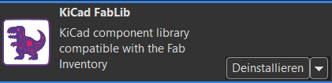
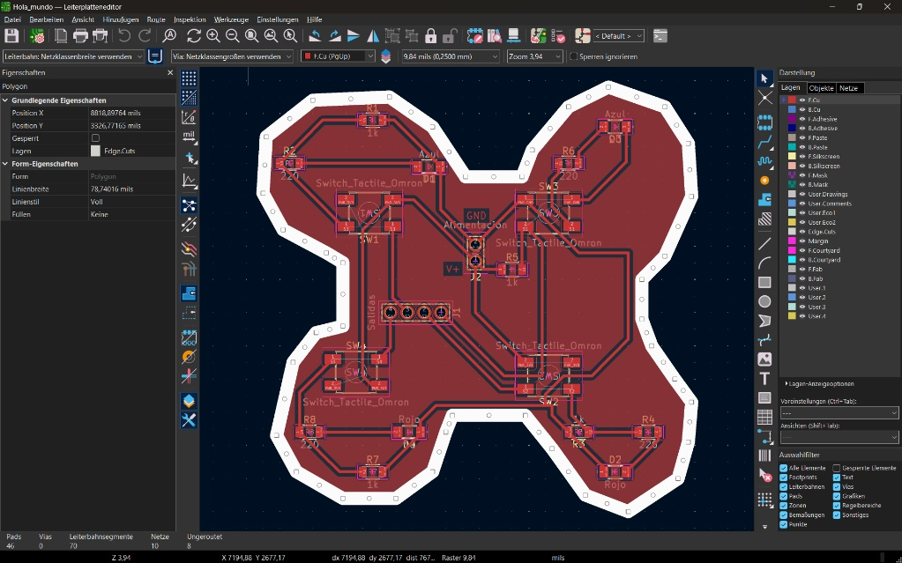

# Reporte de Proyecto: Diseño y Ruteo de PCB en KiCad

**Universidad:** Universidad Iberoamericana Puebla  
**Carrera:** Ingeniería mecatrónica  
**Asignatura:** Producción electrónica   

---

## Participantes del Equipo

| Nombre Completo | Matrícula |
| :--- | :---: |
| **Aldo Ibrahim Alvarez Fernández** | 204916 |
| **Rodrigo Pacheco Valdez** | 195234 |

---

## Tabla de Contenidos

1\. Introducción y Objetivos.  
2\. Instalación de Plugins (KiCad FabLib).  
3\. Diseño del Esquema Eléctrico.  
&nbsp;&nbsp;&nbsp;&nbsp;3.1 Selección de Componentes.  
&nbsp;&nbsp;&nbsp;&nbsp;3.2 Organización y Conexiones.  
4\. Diseño de la Placa de Circuito Impreso (PCB Layout).  
&nbsp;&nbsp;&nbsp;&nbsp;4.1 Definición del Contorno (Edge.Cuts a 2.0 mm).  
&nbsp;&nbsp;&nbsp;&nbsp;4.2 Enrutado y Ancho de Pistas (0.4 mm).  
&nbsp;&nbsp;&nbsp;&nbsp;4.3 Explicación de las Capas del Proyecto.  
5\. Exportación de Datos para Fabricación.  
6\. Conclusiones.

---

## 1. Introducción y Objetivos

Este proyecto describe el proceso que se llevo a cabo en la materia de Producción Electrónica para diseñar, cortar y procesar una placa de cobre a una placa de circuito impreso (PCB) utilizando la herramienta de software libre **KiCad 10**. 

### Objetivos:
* Desarrollar las habilidades y conocimientos básicos en la plataforma KiCad para la elaboración de PCB desde cero.
* Aplicar dichos conocimientos en proyectos de esta y otras materias a futuro como sustituto de la placa de pruebas (protoboard) para routing y conexiones de circuitos. 
* Diseñar un circuito funcional con 4 pulsadores táctiles (`Switch_Tactile_Omron`), 4 LEDs indicadores (Azul y Rojo) con sus respectivas resistencias, y conectores de alimentación/salida.
* Definir una geometría de borde personalizada no rectangular utilizando la capa de corte.
* Aplicar normas de diseño Gerber y criterios de enrutado (ancho de pistas de 0.4 mm y ancho de línea de borde de 2.0 mm).
* Exportar la documentación de fabricación mediante el plugin **KiCad FabLib**.

---

## 2. Instalación de Plugins (KiCad FabLib)

Se agregó el complemento KiCad FabLib para disponer de una biblioteca estandarizada de componentes, símbolos y footprints utilizados comúnmente en entornos Fab Lab, facilitando el diseño y la fabricación de PCB.

### Pasos de Instalación:
1. Abrir la ventana principal de KiCad.
2. Ingresar al **Gestor de Complementos, Plataformas y Bibliotecas** (*Plugin and Content Manager / PCM*).
3. Buscar `KiCad FabLib` o agregar el repositorio correspondiente.
4. Hacer clic en **Instalar** y presionar **Aplicar Cambios**.
5. Reiniciar el editor de PCB.

---

## 3. Diseño del Esquema Eléctrico (Schematic Editor)

En el módulo Editor de Esquemas, se construyó la lógica eléctrica del proyecto.

### 3.1 Selección de Componentes
Se seleccionaron e incorporaron los siguientes símbolos y footprints:
* **Pulsadores (4 unidades):** `SW1`, `SW2`, `SW3`, `SW4` (`Switch_Tactile_Omron`).
* **Diodos LED (4 unidades):** 
  * `D1`, `D3`: LEDs Azules (`Azul`).
  * `D2`, `D4`: LEDs Rojos (`Rojo`).
* **Resistencias:**
  * Resistencias de paso/limitación de $220\,\Omega$: `R2`, `R4`, `R6`, `R8`.
  * Resistencias de *pull-down* de $1\,\text{k}\Omega$: `R1`, `R3`, `R5`, `R7`.
* **Conectores de Interfaz:**
  * `J1`: Conector de Salidas de 4 pines (`Salidas`: `S1`, `S2`, `S3`, `S4`).
  * `J2`: Conector de Alimentación de 2 pines (`Alimentación`: `V3.3 / V+` y `GND`).

### 3.2 Organización y Conexiones
El diseño se estructuró mediante bloques funcionales:
1. **Bloque Entradas y Salidas:** Agrupa las clemas/cabezales `J1` y `J2`.
2. **Bloque Botones:** Agrupa las cuatro etapas de conmutación. Cada botón envía su señal de salida (`S1`–`S4`) al conector `J1` al presionarse y polariza directamente el LED correspondiente. Se emplearon etiquetas globales/locales (`PWR_3V3`, `PWR_GND`, `V3.3`, `GND`) para mantener un esquema limpio y legible.

---

## 4. Diseño de la Placa de Circuito Impreso (PCB Layout)

Una vez transferida la lista de redes al editor de PCB, se procedió al posicionamiento de componentes y ruteo de pistas.

  
*Figura 2: Vista del trazado de la PCB con plano de masa y contorno en X.*

### 4.1 Definición del Contorno (`Edge.Cuts` a 2.0 mm)
* Se diseñó un contorno geométrico personalizado de 4 lóbulos simétricos en forma de "X".
* **Capa asignada:** `Edge.Cuts`.
* **Ancho de línea:** $78.74016\,\text{mils} \approx \mathbf{2.0\,\text{mm}}$, garantizando la visibilidad adecuada para el fresado de la placa en el proceso de ruteado CNC.

### 4.2 Enrutado y Ancho de Pistas (0.4 mm)
* **Ancho de pista por defecto / señales:** Se configuró un ancho de pista de $0.4\,\text{mm}$ ($\approx 15.75\,\text{mils}$) en la clase de red principal, adecuado para el manejo de señales de control e iluminación LED sin caídas térmicas ni de tensión apreciables.

### 4.3 Explicación de las Capas del Proyecto

En el panel lateral de capas se utilizan las siguientes capas fundamentales:

| Capa | Nombre Completo | Función en la Placa |
| :--- | :--- | :--- |
| **`F.Cu`** | *Front Copper* (Cobre Superior) | Aloja las pistas principales de señal y el plano de masa superior (color rojo). |
| **`Edge.Cuts`** | *Board Outline* (Corte del Borde) | Delimita el perímetro exacto que la fresadora o láser recortará para la PCB final (ancho de $2.0\,\text{mm}$). |
| **`User.3`** | *Cuts* (Cortes) | Establece los cortes que se quieren realizar en la PCB. |

---

## 5. Exportación de Datos para Fabricación

1. Se ejecutó la verificación de reglas de diseño (**DRC - Design Rules Check**) para garantizar cero cortocircuitos ni pistas incompletas.
2. Mediante el icono de **FabLib**, se generó la carpeta de manufactura con:
   * **Archivos Gerber (`.gbr`):** `F_Cu.gbr`, `Edge_Cuts.gbr`, `User_3.gbr`.

---

## 6. Conclusiones

* Se logró diseñar exitosamente una PCB totalmente funcional respetando las reglas de diseño para la manipulación manual de prototipos (pistas de 0.4 mm).
* La implementación del contorno en la capa `Edge.Cuts` con grosor de 2.0 mm permitió definir un chasis estético y adaptado al factor de forma deseado.
* La integración de FabLib en KiCad simplificó la creación de la PCB al proporcionar componentes y huellas estandarizadas, permitiendo un diseño más rápido, preciso y adecuado para su posterior fabricación.
